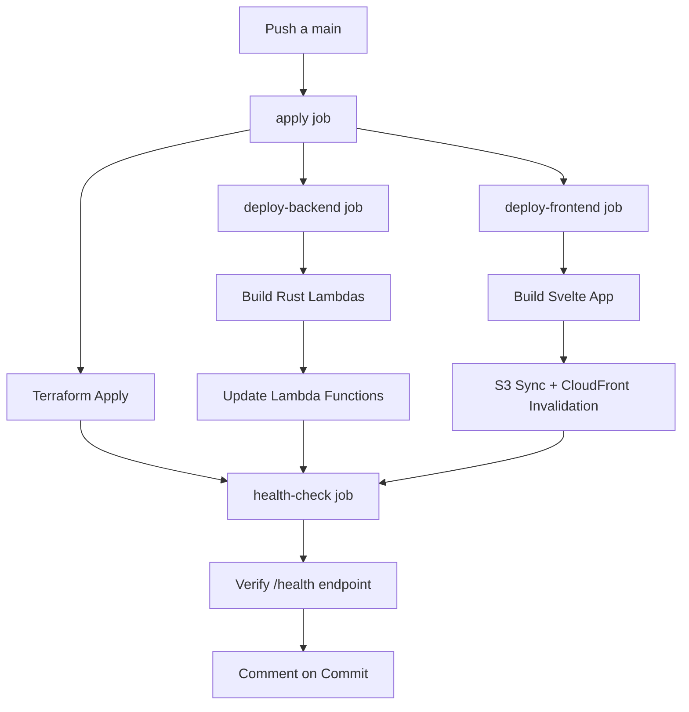
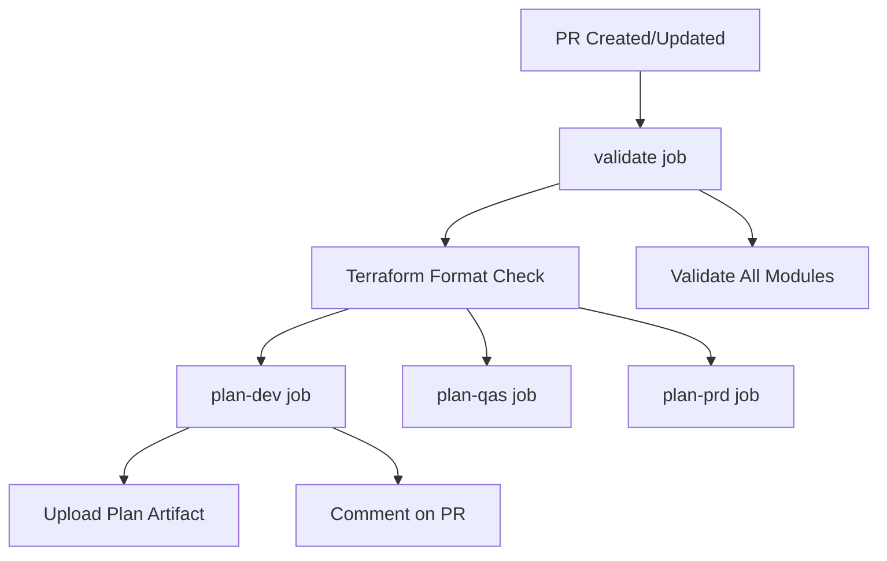

# 🔄 GitHub Actions Workflows

Esta carpeta contiene todos los workflows de CI/CD para el proyecto Turnaki-NexioQ.

---

## 📚 Workflows Disponibles

### Terraform

| Workflow | Trigger | Descripción | Tiempo |
|----------|---------|-------------|--------|
| `terraform-plan.yml` | PR a main | Ejecuta plan en dev/qas/prd | 3-5 min |
| `terraform-apply-dev.yml` | Push a main | Deploy automático en dev | 8-12 min |
| `terraform-apply-qas.yml` | Manual | Deploy manual en qas | 8-12 min |
| `terraform-apply-prd.yml` | Manual | Deploy manual en prd | 10-15 min |
| `terraform-destroy.yml` | Manual | Destruye infraestructura | 5-8 min |

### Backend

| Workflow | Trigger | Descripción | Tiempo |
|----------|---------|-------------|--------|
| `backend-ci.yml` | PR/Push con cambios en backend/ | Tests y build de lambdas | 5-8 min |

### Frontend

| Workflow | Trigger | Descripción | Tiempo |
|----------|---------|-------------|--------|
| `frontend-ci.yml` | PR/Push con cambios en frontend/ | Tests y build de Svelte | 3-5 min |

### Testing

| Workflow | Trigger | Descripción | Tiempo |
|----------|---------|-------------|--------|
| `test-all.yml` | PR/Push | Tests exhaustivos (backend + frontend + E2E) | 10-15 min |

---

## 🚀 Uso Rápido

### Para Desarrolladores

#### 1. Trabajar en Feature Branch

```bash
git checkout -b feature/nueva-funcionalidad
# Hacer cambios...
git commit -am "feat: nueva funcionalidad"
git push origin feature/nueva-funcionalidad
```

#### 2. Crear Pull Request

- En GitHub: **New Pull Request**
- Workflows automáticos que se ejecutan:
  - ✅ `terraform-plan.yml` (si hay cambios en terraform/)
  - ✅ `backend-ci.yml` (si hay cambios en backend/)
  - ✅ `frontend-ci.yml` (si hay cambios en frontend/)
  - ✅ `test-all.yml` (siempre)

#### 3. Revisar Resultados

- Ver comentario con `terraform plan` en el PR
- Verificar que todos los checks pasen ✅
- Solicitar code review

#### 4. Merge a Main

- Una vez aprobado, hacer merge
- `terraform-apply-dev.yml` se ejecuta automáticamente
- Dev se actualiza en ~10 minutos

---

### Para DevOps / Admins

#### Deploy a QAS

```bash
# Opción 1: Desde GitHub UI
# 1. Ir a Actions → Terraform Apply QAS
# 2. Run workflow → confirm: yes
# 3. Aprobar (required reviewers)

# Opción 2: Desde CLI
gh workflow run terraform-apply-qas.yml -f confirm=yes
```

#### Deploy a Producción

```bash
# 1. Crear release tag
git tag -a v1.2.0 -m "Release v1.2.0"
git push origin v1.2.0

# 2. Ejecutar workflow
gh workflow run terraform-apply-prd.yml -f confirm=yes

# 3. Aprobar (2+ reviewers requeridos)

# 4. Monitorear deployment
gh run watch
```

#### Destruir Ambiente (Dev/QAS)

```bash
gh workflow run terraform-destroy.yml \
  -f environment=dev \
  -f confirm=DESTROY \
  -f backup_data=true
```

---

## 🔐 Configuración Inicial

### Prerrequisitos

Antes de ejecutar workflows por primera vez:

1. **Configurar Secrets de AWS**
   - Ver: `.github/SECRETS_SETUP.md`
   - Configurar `AWS_ROLE_TO_ASSUME`
   - Configurar `AWS_ROLE_TO_ASSUME_PRD`

2. **Crear Environments**
   - Settings → Environments
   - Crear: `dev`, `qas`, `prd`
   - Configurar required reviewers en qas y prd

3. **Proteger Branch Main**
   - Settings → Branches → Add rule
   - Requerir PR reviews
   - Requerir status checks (workflows)

---

## 📊 Arquitectura de Workflows

### terraform-apply-dev.yml



### terraform-plan.yml



---

## 🐛 Troubleshooting

### Error: "terraform init failed"

**Causa:** No hay acceso al bucket S3 del tfstate

**Solución:**
```bash
# Verificar que el rol IAM tiene acceso
aws s3 ls s3://tk-nq-backups-tfstate/

# Verificar secret AWS_ROLE_TO_ASSUME
gh secret list
```

---

### Error: "Could not assume role"

**Causa:** Trust policy del rol IAM incorrecto

**Solución:**
```bash
# Verificar trust policy
aws iam get-role --role-name github-actions-terraform-dev

# Debe incluir:
# "Federated": "arn:aws:iam::ACCOUNT:oidc-provider/token.actions.githubusercontent.com"
# "StringLike": {
#   "token.actions.githubusercontent.com:sub": "repo:ORG/turnaki-nexioq:*"
# }
```

---

### Error: "cargo lambda build failed"

**Causa:** Dependencias de Rust no instaladas o cache corrupto

**Solución:**
```bash
# Re-ejecutar workflow limpiando cache
gh workflow run backend-ci.yml
# En GitHub Actions UI: "Re-run jobs" → "Re-run failed jobs"
```

---

### Error: "Health check failed"

**Causa:** Lambdas no desplegadas correctamente o API Gateway no actualizado

**Solución:**
```bash
# Verificar que lambdas existen
aws lambda list-functions | grep tk-nq-dev

# Verificar health endpoint manualmente
curl https://<API-URL>/health

# Verificar logs de CloudWatch
aws logs tail /aws/lambda/tk-nq-dev-health --follow
```

---

## 📈 Mejores Prácticas

### 1. Siempre Crear PR

❌ **Evitar:**
```bash
git push origin main  # Nunca push directo a main
```

✅ **Hacer:**
```bash
git checkout -b feature/mi-cambio
git push origin feature/mi-cambio
# Crear PR en GitHub
```

---

### 2. Revisar Terraform Plan

Antes de hacer merge:
1. Revisar comentario con `terraform plan` en el PR
2. Verificar que los cambios son los esperados
3. Preguntar a DevOps si hay dudas

---

### 3. Monitorear Deployments

Después de merge a main:
1. Ir a Actions tab
2. Ver progreso de `terraform-apply-dev`
3. Verificar que health check pase
4. Probar funcionalidad en dev

---

### 4. Tags para Producción

Antes de deploy a prd:
```bash
# Crear tag semántico
git tag -a v1.2.3 -m "Release v1.2.3 - Descripción"
git push origin v1.2.3

# El workflow automáticamente creará un tag adicional:
# prd-2025-10-06-abc1234
```

---

### 5. Rollback en Producción

Si algo sale mal:

```bash
# 1. Identificar última versión estable
git tag -l "prd-*" | tail -5

# 2. Checkout a ese commit
git checkout <commit-sha-del-tag>

# 3. Re-ejecutar deploy
gh workflow run terraform-apply-prd.yml -f confirm=yes
```

---

## 📚 Referencias

- [Terraform en GitHub Actions](https://developer.hashicorp.com/terraform/tutorials/automation/github-actions)
- [GitHub Actions Docs](https://docs.github.com/en/actions)
- [AWS OIDC Setup](https://docs.github.com/en/actions/deployment/security-hardening-your-deployments/configuring-openid-connect-in-amazon-web-services)
- [Configuración de Secrets](./../SECRETS_SETUP.md)

---

## 🆘 Soporte

- 📧 Email: devops@turnaki.com
- 💬 Slack: #devops-turnaki
- 🐛 Issues: [GitHub Issues](https://github.com/tu-org/turnaki-nexioq/issues)

---

**Última actualización:** 6 de Octubre 2025
