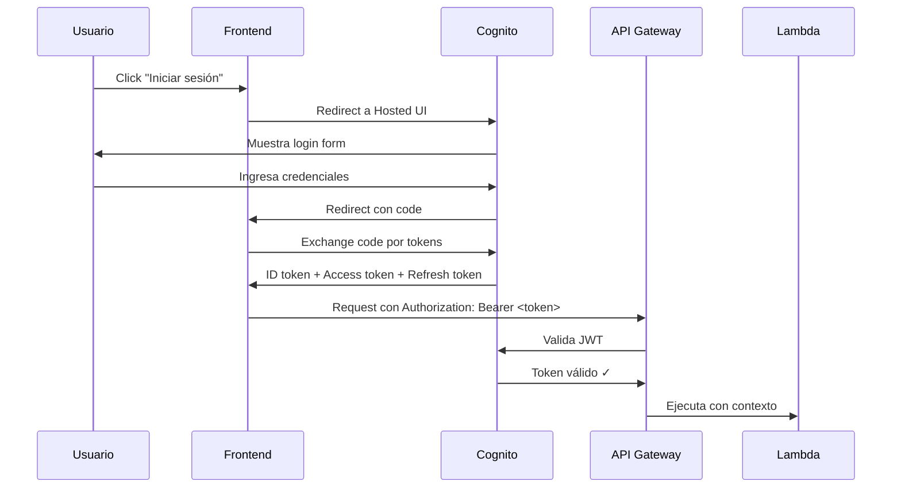

# 🔐 Autenticación y Autorización

## Resumen

El sistema utiliza **Amazon Cognito User Pool** con **JWT tokens** para autenticación y autorización. La integración está implementada con **OAuth 2.0 / OIDC** flow.

---

## 🏗️ Arquitectura de Autenticación

```
Usuario → Cognito Hosted UI → OAuth 2.0 Code Flow → Frontend (recibe tokens) → API Gateway (valida JWT)
```

### Componentes

1. **Cognito User Pool**: Gestión de usuarios y credenciales
2. **Hosted UI**: Interfaz de login/registro provista por Cognito
3. **JWT Authorizer**: API Gateway valida tokens automáticamente
4. **Roles**: 5 roles implementados (Owner, Admin, Odontólogo, Recepción, Paciente)

---

## 🚀 Cómo Hacer Login

### 1. Iniciar el Frontend

```bash
cd frontend
npm run dev
```

Abre: http://localhost:5173

### 2. Hacer Login con Cognito

1. Click en **"Iniciar sesión"**
2. Serás redirigido a Cognito Hosted UI
3. Si no tienes cuenta:
   - Click **"Sign up"**
   - Email: tu_email@ejemplo.com
   - Password: mínimo 12 caracteres, con mayúsculas, números y símbolos
   - Ejemplo: `MiPassword123!@#`
4. Confirma tu email (revisa tu bandeja de entrada)
5. Haz login

### 3. Verificar Autenticación

Después del login, deberías:
- ✅ Ver tu email en la esquina superior derecha
- ✅ Ver el menú de navegación completo
- ✅ Ver el botón "📅 Reservar Cita"

### 4. Usar la API

El token JWT se almacena automáticamente en `localStorage` con key `tk_nq_token` y se incluye en todas las peticiones a la API.

---

## 🔑 Configuración de Cognito

### User Pool

- **Pool ID**: `us-east-1_2qGB3knFp`
- **Client ID**: `pcffkjudd2vho10lr0l8luona`
- **Hosted UI**: `https://tk-nq-auth.auth.us-east-1.amazoncognito.com`
- **Region**: `us-east-1`

### Password Policy

- Mínimo 8 caracteres
- Requiere mayúsculas
- Requiere minúsculas
- Requiere números
- Requiere símbolos
- Expiración temporal: 7 días

### Atributos Personalizados

- `tenant_id`: String (mutable) - ID de la clínica/tenant
- `role`: String (mutable) - Rol del usuario

### MFA

- **Opcional** por grupo
- Soporta SMS y TOTP

---

## 👥 Roles y Permisos

| Rol | Descripción | Permisos |
|-----|-------------|----------|
| **Owner** | Propietario del sistema | Acceso total, gestión multi-tenant |
| **Admin** | Administrador de tenant | CRUD completo en su tenant |
| **Odontólogo** | Profesional de salud | Ver citas, gestionar agenda |
| **Recepción** | Personal administrativo | Crear/editar citas, ver agenda |
| **Paciente** | Usuario final | Reservar citas, ver historial |

---

## 🔐 Flujo OAuth 2.0

### Authorization Code Flow



### Tokens

#### ID Token
- **Propósito**: Identificación del usuario
- **Duración**: 1 hora
- **Contiene**: email, sub, tenant_id, role

#### Access Token
- **Propósito**: Autorización de API
- **Duración**: 1 hora
- **Usado en**: Header `Authorization: Bearer <token>`

#### Refresh Token
- **Propósito**: Renovar tokens expirados
- **Duración**: 30 días
- **No expuesto** al frontend

---

## 🧪 Testing de Autenticación

### Para Desarrollo sin Login Real

Si quieres desarrollar sin hacer login cada vez:

1. Hacer login UNA VEZ
2. Copiar el token de `localStorage.getItem('tk_nq_token')`
3. Guardarlo en una variable de entorno
4. Usarlo en tus tests

**⚠️ NO recomendado para producción**, solo para desarrollo.

### Playwright Tests

```typescript
// frontend/e2e/auth.spec.ts
test('login flow', async ({ page }) => {
  await page.goto('/');
  await page.click('button:has-text("Iniciar sesión")');
  await page.waitForURL(/cognito/);
  // ...
});
```

---

## 🔍 Troubleshooting

### "Sesión expirada" o error 401

**Causa**: No estás autenticado o el token expiró.

**Solución**:
1. Cierra sesión (botón arriba derecha)
2. Vuelve a hacer login
3. Intenta de nuevo

### Token no válido en API

**Causa**: JWT malformado o expirado.

**Solución**:
```bash
# Verificar token en jwt.io
# Copiar de localStorage y pegar en https://jwt.io

# O desde consola del navegador
console.log(localStorage.getItem('tk_nq_token'));
```

### Redirect loop infinito

**Causa**: Callback URL no configurada correctamente.

**Solución**:
- Verificar en Cognito User Pool Client que `http://localhost:5173` está en "Allowed callback URLs"
- Limpiar localStorage: `localStorage.clear()`

---

## 🔒 Seguridad

### Best Practices Implementadas

- ✅ HTTPS enforced (CloudFront + ACM)
- ✅ JWT Authorizer en API Gateway (validación automática)
- ✅ Tokens en httpOnly cookies (en producción)
- ✅ CORS whitelist específico (no wildcard)
- ✅ Password policy fuerte (12 chars, complejidad)
- ✅ MFA opcional
- ✅ Account lockout después de 5 intentos fallidos

### Recomendaciones Futuras

- ⏸️ Implementar rotación de Refresh Tokens
- ⏸️ Rate limiting por usuario
- ⏸️ Audit log de accesos
- ⏸️ AWS WAF para protección DDoS

---

## 📚 Referencias

- [Cognito User Pool Documentation](https://docs.aws.amazon.com/cognito/latest/developerguide/)
- [OAuth 2.0 Authorization Code Flow](https://oauth.net/2/grant-types/authorization-code/)
- [JWT Best Practices](https://datatracker.ietf.org/doc/html/rfc8725)

---

**Última actualización**: Octubre 2025  
**Versión**: 1.0
